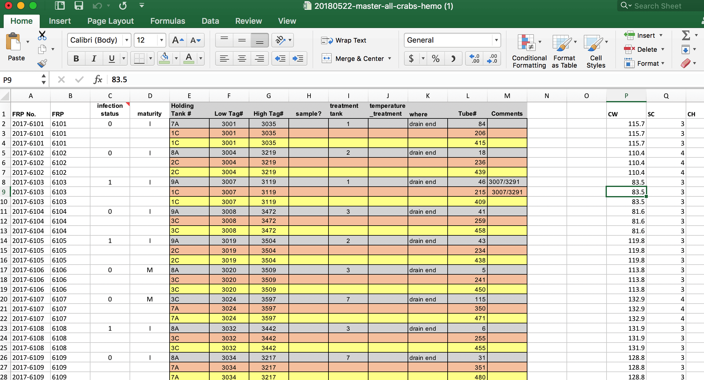

## Situation
There are a lot of various files that need to be combined such that the table can be easily queried.


Here is what the current "Master" looks like




```{r}
library(tidyverse)
```

```{r}
    prim_master <- read_csv("../data/20180522-master-all-crabs-hemo-mod2.csv")
```


