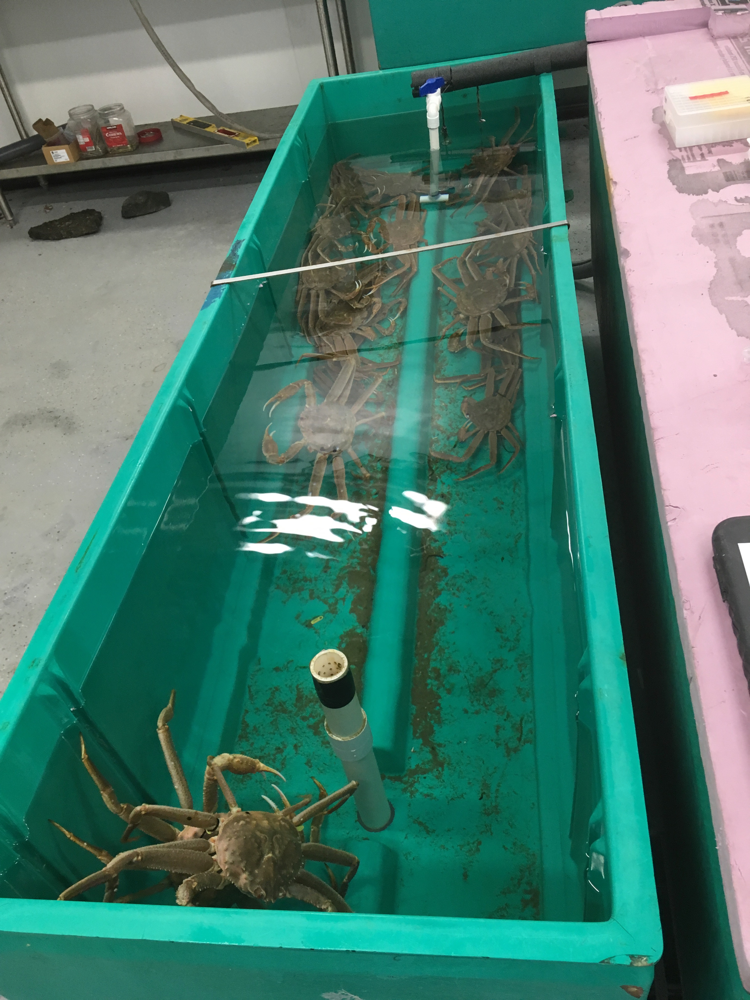
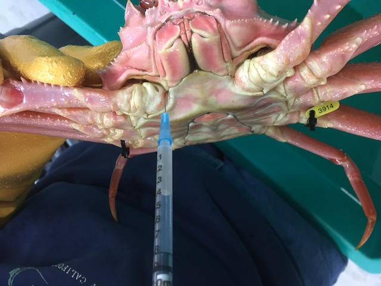
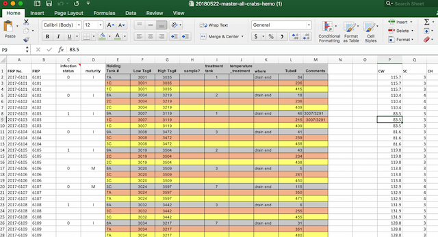

```{r setup, include=FALSE}
knitr::opts_chunk$set(echo = FALSE)
```

## R Markdown

This is an R Markdown presentation. Markdown is a simple formatting syntax for authoring HTML, PDF, and MS Word documents. For more details on using R Markdown see <http://rmarkdown.rstudio.com>.

When you click the **Knit** button a document will be generated that includes both content as well as the output of any embedded R code chunks within the document.

## Slide with Bullets

- Bullet 1
- Bullet 2
- Bullet 3

## Slide with R Output

```{r cars, echo = TRUE}
summary(cars)
```

## Slide with Plot

```{r pressure}
plot(pressure)
```


## Backstory 
Tanner crabs were captured and brought back in the lab to be tested for the presence of bitter crab disease. Crabs were then placed in three different temperature treatments to examine how temperature influences disease progression.     




## Data Wrangling Problem
There are a lot of crabs. We have intitial design data including presumed disease state (cPCR), quantitative PCR confirming disease status, and RNA levels. We need to decide on which crabs will be used to construct RNA-seq libraries to look at immune response genes. 




## The Starting table

Here is what the "Master" looks like. What is wrong here?



## Bringing in data

`

```{r, echo = TRUE}
library(tidyverse)
```


## Bringing in data

```{r, echo = TRUE}
    prim_master <- read_csv("../data/20180522-master-all-crabs-hemo-mod3.csv")
```


## Issue?

```{r, echo = TRUE}
prim_master
```

## Issue?

```{r, echo = TRUE}
knitr::kable(prim_master)
```


## Where to be at the end?

That is one of the take home messages in terms of thinking through where you want to be.


## Table 2

```{r, echo = TRUE}
first_pcr <- read.csv("../data/20180522-master-qPCR-all-runs.csv")
knitr::kable(first_pcr)
``` 

## Mini-issue
_email_
>>You can easily add the dates. Any crab with a 37- or 38- prefix in the sample no. was from Day 26 -- those also have tube #s, cuz the aliquots (DNA in RNAlater) came from you. All the crabs with 30- thru 34- were sampled on day 0/1. Make sense?

## Solution


```{r, echo = TRUE}
mutate(first_pcr, sampleday = 
  ifelse(Sample_pre == 37 | Sample_pre == 38, "day26", 
  ifelse(Sample_pre == 30 | Sample_pre == 31 | Sample_pre == 32 | Sample_pre == 33 | Sample_pre == 34, "day01", 
  "unknown"))) 
```
